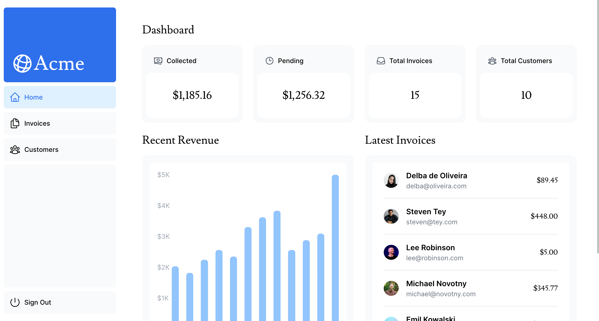

# Simplified Financial Dashboard

> This is a Next.js project-based learning from [Next.js Website](https://nextjs.org/learn/dashboard-app).



## CSS Styling

> Take a look at the [CSS documentation](https://nextjs.org/docs/app/building-your-application/styling) for more information.

1. Global styles - import `global.css` in `/app/layout.tsx`
2. How to apply CSS styles in Next.js
   - [Tailwind CSS](https://tailwindcss.com/)
   - [CSS Modules](https://nextjs.org/docs/basic-features/built-in-css-support)
   - Sass
   - CSS-in-JS libraries such as [styled-components](https://github.com/vercel/next.js/tree/canary/examples/with-styled-components)

### `clsx` Library - conditionally apply class names

> [clsx](https://www.npmjs.com/package/clsx) is a library that lets you toggle class names easily. View [documentation](https://github.com/lukeed/clsx) for more details.

Basic usage:

```tsx
import clsx from 'clsx';

export default function InvoiceStatus({ status }: { status: string }) {
  return (
    <span
      className={clsx(
        'inline-flex items-center rounded-full px-2 py-1 text-sm',
        {
          'bg-gray-100 text-gray-500': status === 'pending',
          'bg-green-500 text-white': status === 'paid',
        },
      )}
    >
    // ...
)}
```

## Fonts

> See the documentation for [adding multiple fonts](https://nextjs.org/docs/app/building-your-application/optimizing/fonts#using-multiple-fonts) and the [full list of options](https://nextjs.org/docs/app/api-reference/components/font#font-function-arguments).

Next.js automatically optimizes fonts in the application when you use the next/font module.

It downloads font files at build time and hosts them with your other static assets.

This means when a user visits your application, there are no additional network requests for fonts which would impact performance.

## Images

> [Image Optimization Docs](Image Optimization Docs)

Instead of manually implementing optimizations such as responsive images, lazy load images, you can use the `next/image` component to automatically optimize your images.

use Next.js `<Image>` instead of traditional HTML ``

## Navigating Between Pages

> Learn more about [how navigation works](https://nextjs.org/docs/app/building-your-application/routing/linking-and-navigating#how-routing-and-navigation-works).

Traditional HTML `<a>` tag will cause full page refresh on each page navigation.

In Next.js, use `<Link>` to link between pages in your application.

### How to show an active link

In order to show an active link, you need to get the user's current path from the URL. Next.js provides [`usePathname()`](https://nextjs.org/docs/app/api-reference/functions/use-pathname) hook so we can check the path name.

1. Create Variable `pathname`

   ```tsx
   'use client';

   // ...
   import { usePathname } from 'next/navigation';

   export default function NavLinks() {
     const pathname = usePathname();
     // ...
   }
   ```

2. When `pathname` matches `link.href`, the link should be displayed with active style.
   ```tsx
   <Link
      key={link.name}
      href={link.href}
      className={clsx(
        '...',
        {
          'bg-sky-100 text-blue-600': pathname === link.href,
        },
      )}
    >
   ```

## Setup Database

> [Setting Up Your Database](https://nextjs.org/learn/dashboard-app/setting-up-your-database)

Set database with Vercel and PostgresSQL

## Fetch Data

> Different ways of [fetch data in Next.js](https://nextjs.org/learn/dashboard-app/fetching-data).

## Search and Pagination

> read [Search and Pagination](https://nextjs.org/learn/dashboard-app/adding-search-and-pagination)

## Mutate Data

> Mutate date using form and server action. Read more about [security with Server Actions](https://nextjs.org/blog/security-nextjs-server-components-actions)